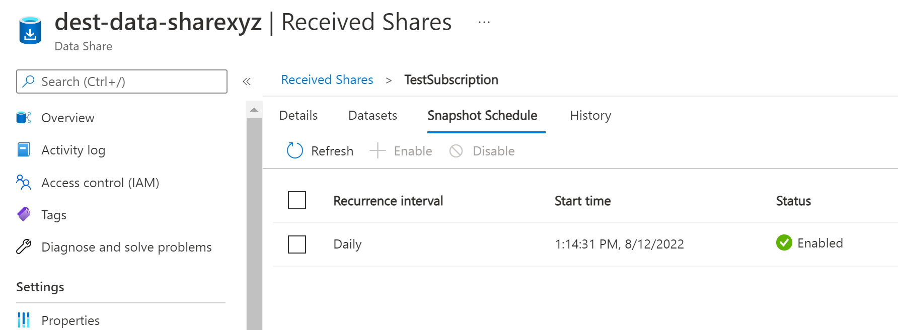

# Data Share Automation

- [Data Share Automation](#data-share-automation)
  - [Description](#description)
    - [source.py](#sourcepy)
    - [dest.py](#destpy)
    - [Azure Function](#azure-function)
  - [Prerequisites](#prerequisites)
    - [Bash](#bash)
    - [Powershell](#powershell)
  - [Creating the service principal](#creating-the-service-principal)
  - [Role Assignments](#role-assignments)
  - [Sharing data](#sharing-data)
    - [Configuration](#configuration)
    - [Authentication](#authentication)
    - [Running](#running)
  - [Receiving data](#receiving-data)
    - [Configuration](#configuration-1)
    - [Authentication](#authentication-1)
    - [Running](#running-1)
  - [Triggering the scan](#triggering-the-scan)
  - [Using an Azure Function](#using-an-azure-function)
    - [Requirements](#requirements)
    - [F5 experience](#f5-experience)
    - [Authentication](#authentication-2)

## Description

[Azure Data Share](https://azure.microsoft.com/en-us/services/data-share/) setup requires a number of steps to establish the connection between the source data and the destination. One of those steps is sending an invitation from a source data share account and accepting the invitation in a destination data share account.

Through the portal UI, invitations can only be sent to email addresses and that requires the email recipient to perform some manual steps to accept the invitation and map the incoming data to the destination. However, the Azure Data Share SDK allows invitations to be sent to *service principals* as well, which opens up the opportunity to fully automate the process, even between different subscriptions and tenants.

This code illustrates how to perform a fully automated data sharing process between two pre-existing Data Share accounts.

It includes two separate Python scripts and an azure function:

### source.py

- Creates a share in a data share account
- Sets up a dataset from a ADLSGen2 storage account file system
- Creates a synchronization schedule for the share
- Sends out an invitation to a service principal on a specific Azure AD tenant

### dest.py

- Lists invitations sent to the user
- Creates a subscription for a share
- Creates mappings for the shared datasets that point to an ADLSGen2 storage account file system
- Enables the scheduling trigger

### Azure Function

An Azure Function with a timer trigger is included, so the acceptance of invitations can be fully automated instead of on-demand.
This code can be found on the `azure_function` folder but it's recommended that the scripts are used for initial debugging and testing.

## Prerequisites

- A *source* Azure Data Share account
- A *source* Azure Storage Data Lake account (Gen2)
- A *destination* Azure Data Share account
- A *destination* Azure Storage Data Lake account (Gen2)

The *source* and *destination* assets can be created in different Azure subscriptions and tenants.

The `infra` folder includes bash and powershell scripts to setup these 4 assets in a new resource group under a single subscription. The scripts also create a container in the *source* storage account and upload this Readme.md file to it so we have some data to be shared.

> Note: [Azure CLI](https://docs.microsoft.com/en-us/cli/azure/) is required to execute these scripts.

### Bash

```bash
# login and make sure the right subscription is selected
az login
# setup infrastructure
./infra/bash_setup_infra.sh
```

### Powershell

```powershell
# login and make sure the right subscription is selected
az login
# setup infrastructure
./infra/ps_setup_infra.ps1
```

## Creating the service principal

To automate the acceptance of the invitation, a service principal must be created in the destination Azure AD tenant.

```bash
az ad sp create-for-rbac --name "<insert_sp_name>"
```

It will output something like this:

```json
{
  "appId": "b50dc79f-7120-46e6-8703-1ebdb0a5e66b",
  "displayName": "azure-data-share-test",
  "name": "b50dc79f-7120-46e6-8703-1ebdb0a5e66b",
  "password": "<generated-client-secret>",
  "tenant": "<your-tenant-id>"
}
```

The **appId**, **password** and **tenant** are required by the Python scripts.

Additionally, we need the **objectId** of the service principal, which can be obtained by running the following command:

```bash
az ad sp list --display-name <insert_sp_name> --query []."id" -o tsv
```

These values will be referenced in the scripts through environment variables:

- AZURE_CLIENT_ID: appId
- AZURE_CLIENT_SECRET: password
- AZURE_TENANT_ID: tenant

The objectId will be used in the `source.py` script as the target of the invitation.

## Role Assignments

- The **source** data share MSI must have the **Storage Blob Data Reader** role in the source storage account

    Example:
    

- The **destination** data share MSI must have the **Storage Blob Data Contributor** role in the destination storage account.

## Sharing data

First we need to create the share, select the data we want to share and send an invitation. Those tasks are all automated in the `python\source.py` script.

### Configuration

In the `python/source.py` file, modify the following settings to match your configuration:

```python
# source data share settings
subscription_id = "<source-subscription-id>"
resource_group_name = "data-share-automation"
account_name = "source-data-sharexyz"
share_name = "TestShare"
dataset_name = "TestDataSet"
storage_account_name = "sourcestoragexyz"
file_system_name = "source-data"

# destination object for invitation
dest_tenant_id = "<destination_tenant_id>"
dest_object_id = "<destination_object_id>"

# destination email address
dest_email_address = None
```

Make sure you correctly configure the `dest_object_id` variable to the **objectId** of the service principal created earlier and update the `dest_tenant_id`.

### Authentication

The source script uses the DefaultAzureCredential class for authenticating on Azure. It uses one of several authentication mechanisms:

- The EnvironmentCredential is the first method tried by the DefaultAzureCredential class. It will look for the environment variables AZURE_CLIENT_ID, AZURE_SECRET_ID and AZURE_TENANT_ID

- It they aren't set, it will try to use Managed Identities which will be available in a hosting environment such as Azure App Service.

- If not present, it will try AZ CLI login credentials, provided az login command is ran before using it.
This is a simple way of running the script under your Azure account identity (and if you created the assets yourself, you should already have all the required permissions and roles over the resources)

The identity running the script must have the following permissions:

*Source* Data Share Account:

- **Contributor**

*Source* Storage Account:

- **Contributor**
- **User Access Administrator**

The simplest process is to run the script using your AZ CLI credentials which requires no setup.

However, if you do want to run in the context of a service principal account, you should create a `source.env` file in the `python` folder and add the following values:

```env
AZURE_CLIENT_ID=client_id
AZURE_CLIENT_SECRET=client_secret
AZURE_TENANT_ID=tenant_id
```

The script is prepared to read this file if it exists and will default to using service principal credentials.

### Running

Execute the following commands:

```bash
cd python
pip install -r requirements.txt

# if using az cli credentials
az login

python source.py
```

The script should be indempotent so you can run it multiple times. As a result, you should see a share created in your *source* data share account:


A schedule should be configured on the share:


A dataset should be configured and mapped to the storage account container:


Finally, an invitation should exist for the service principal:


## Receiving data

Now, we need to accept the sent invitation, map the incoming data to the destination storage account and setup the schedule. Those tasks are automated in the `python\dest.py` script.

### Configuration

In the `python/dest.py` file, modify the following settings to match your configuration:

```python
# destination data share settings
subscription_id = "<dest_subscription_id>"
account_name = "dest-data-sharexyz"
resource_group_name = "data-share-automation"
subscription_name = "TestSubscription"
dest_storage_account_name = "deststoragexyz"
```

### Authentication

To automate the acceptance of the invitation sent to the service principal, you must run the `dest.py` script under that identity.

For that, create a `.env` file in the `python` folder and add the following values:

```env
AZURE_CLIENT_ID=client_id
AZURE_CLIENT_SECRET=client_secret
AZURE_TENANT_ID=tenant_id
```

This will ensure the script runs in the context of your service principal account and is able to access the sent invitation.

The service principal must have the following permissions:

*Destination* Data Share Account:

- **Contributor**

*Destination* Storage Account:

- **Contributor**
- **User Access Administrator**

### Running

Execute the following commands:

```bash
cd python
pip install -r requirements.txt

python dest.py
```

After the invitation is accepted, the script can't be run again. If you need to re-run it, please create a new invitation using the `dest.py` python script.

After the script executes you should see a subscription setup on the Received Shares on the *destination* azure data share account:


You can also see the incoming data being mapped to the *destination* storage account:


Finally, you can see the scheduling setup for the incoming data share:



## Triggering the scan

You can now wait for the scheduled time on the data share subscription or force a snapshot sync in the destination data share account:


Soon you will see the Readme.md file in the *destination* storage account, inside the mapped container.

## Using an Azure Function

We can take the destination script and code it as an Azure Function with a timer trigger. This way, we have a reliable way to automate the process of accepting invitations.

The `azure_function` folder includes the code required. To execute the code locally, a `local.settings.json` file should be created in the `azure_function` folder with the following content:

```json
{
  "IsEncrypted": false,
  "Values": {
    "FUNCTIONS_WORKER_RUNTIME": "python",
    "AzureWebJobsStorage": "UseDevelopmentStorage=true",
    "DATA_SHARE_ACCOUNT_NAME": "",
    "DATA_SHARE_RESOURCE_GROUP_NAME": "",
    "DATA_SHARE_AZURE_SUBSCRIPTION_ID": "",
    "DESTINATION_STORAGE_ACCOUNT_NAME": "",
    "DESTINATION_STORAGE_RESOURCE_GROUP_NAME": "",
    "DESTINATION_STORAGE_SUBSCRIPTION_ID": "",
    "AZURE_CLIENT_ID": "",
    "AZURE_CLIENT_SECRET": "",
    "AZURE_TENANT_ID": ""
  }
}
```

### Requirements

- [Azure Function Core Tools](https://learn.microsoft.com/en-us/azure/azure-functions/functions-run-local?tabs=v4%2Cwindows%2Ccsharp%2Cportal%2Cbash) must be installed
- [Azurite extension](https://marketplace.visualstudio.com/items?itemName=Azurite.azurite) is required for local debugging - alternatively, the AzureWebJobsStorage must be configured to use a real Azure Storage account

### F5 experience

The `.vscode/launch.json` includes the required configuration to debug the Azure Function. Make sure the *Debug Azure Function* configuration is selected on the *Run and Debug* (Ctrl+Shift+D) options.

> Note: the function will quickly exit if no invitations are found. You can use the `source.py` file on the `python` folder to setup an invitation before running the function to test the behavior.

The function will go through the same steps as the `dest.py` script detailed above and will achieve the same result.

### Authentication

Note that the function is also using the service principal created before. This will allow the function to accept the invitation but also to authenticate against the Data Share service and the destination storage account to setup the share subscription.

The service principal must have the following permissions:

*Destination* Data Share Account:

- **Contributor**

*Destination* Storage Account:

- **Contributor**
- **User Access Administrator**

However, a good option might be to use Azure Managed Identities instead once the function is deployed to Azure. In that case, there are three simple steps to be performed:

- Do not include `AZURE_CLIENT_ID`, `AZURE_CLIENT_SECRET` and `AZURE_TENANT_ID` in the function settings. It will default to use the managed identity for authentication and authorization.
- Make sure the managed identity of the Azure Function has the correct permissions over Data Share account and storage account (as defined above for the service principal)
- Modify `source.py` so that the invitation is sent to the objectId of the managed identity instead of the service principal. As a reminder, you can get this value by running the following command:

  ```bash
  az ad sp list --display-name <managed_identity_name> --query []."id" -o tsv
  ```
